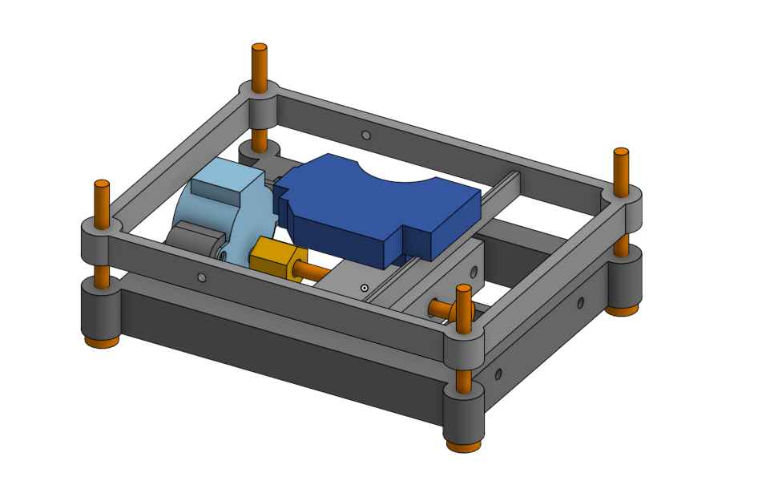

# Laser Microscope

This is the repo where my laser microscope lives.

  

# Project Overview

This project uses a blue-ray reader laser to take images. The working principle is
based on a scanning the surface of the object. The laser beam is focused onto
the surface, and the intensity of the reflected light is measured by a
photodiode as the laser (or the object) moves along a grid. This means that the
reader reads one pixel at a time, leaving us with a challenge: the quality of
an image is proportional to how long we are willing to wait. 

In addition to this waiting challenge, the Nyquist sampling theorem dictates
that we need a sampling rate of at least 2x frequency to reproduce a signal (In
practical applications, this often needs to be closer to 5x to ensure an OK
signal). There is, however, a workaround implemented in this project,
[Compressed Sensing](https://en.wikipedia.org/wiki/Compressed_sensing). A more
detailed explanation of how compressed sensing is applied in this project will
be provided in the research folder or on my website.

# TASK
- [ ] Find code on old computer
- [ ] Find electronics schematic old computer 
- [ ] Finish research PDF in Typst
- [ ] Make overview and a more thorough explanation 

